# PSoC 6 MCU: Low-Power CapSense (FreeRTOS)

This code example demonstrates how to create a low-power CapSense® design using PSoC 6 MCU. This example features a 5-segment CapSense slider and a Ganged Sensor, and displays the detected touch position over the serial terminal. This example uses the [CapSense Middleware Library](https://github.com/cypresssemiconductorco/capsense).

[Provide feedback on this Code Example.](https://cypress.co1.qualtrics.com/jfe/form/SV_1NTns53sK2yiljn?Q_EED=eyJVbmlxdWUgRG9jIElkIjoiQ0UyMzA5NjgiLCJTcGVjIE51bWJlciI6IjAwMi0zMDk2OCIsIkRvYyBUaXRsZSI6IlBTb0MgNiBNQ1U6IExvdy1Qb3dlciBDYXBTZW5zZSAoRnJlZVJUT1MpIiwicmlkIjoic2JrciIsIkRvYyB2ZXJzaW9uIjoiMS4wLjAiLCJEb2MgTGFuZ3VhZ2UiOiJFbmdsaXNoIiwiRG9jIERpdmlzaW9uIjoiTUNEIiwiRG9jIEJVIjoiSUNXIiwiRG9jIEZhbWlseSI6IlBTT0MifQ==)

## Requirements

- [ModusToolbox® software](https://www.cypress.com/products/modustoolbox-software-environment) v2.2
- Board Support Package (BSP) minimum required version: 2.0.0  
- Programming Language: C  
- Associated Parts: All [PSoC® 6 MCU](http://www.cypress.com/PSoC6) parts

## Supported Toolchains (make variable 'TOOLCHAIN')

- GNU Arm® Embedded Compiler v9.3.1 (GCC_ARM) - Default value of `TOOLCHAIN`
- Arm compiler v6.14.1 (ARM)
- IAR C/C++ compiler v8.42.2 (IAR)

## Supported Kits (make variable 'TARGET')

- [PSoC 6 Wi-Fi BT Prototyping Kit](https://www.cypress.com/CY8CPROTO-062-4343W) (CY8CPROTO-062-4343W) - Default value of `TARGET`
- [PSoC 6 WiFi-BT Pioneer Kit](https://www.cypress.com/CY8CKIT-062-WiFi-BT) (CY8CKIT-062-WIFI-BT)
- [PSoC 6 BLE Pioneer Kit](https://www.cypress.com/CY8CKIT-062-BLE) (CY8CKIT-062-BLE)
- [PSoC 62S2 Wi-Fi BT Pioneer Kit](https://www.cypress.com/CY8CKIT-062S2-43012) (CY8CKIT-062S2-43012)
- [PSoC 62S1 Wi-Fi BT Pioneer Kit](https://www.cypress.com/CYW9P62S1-43438EVB-01) (CYW9P62S1-43438EVB-01)
- [PSoC 62S1 Wi-Fi BT Pioneer Kit](https://www.cypress.com/CYW9P62S1-43012EVB-01) (CYW9P62S1-43012EVB-01)
- [PSoC 62S3 Wi-Fi BT Prototyping Kit](https://www.cypress.com/CY8CPROTO-062S3-4343W) (CY8CPROTO-062S3-4343W)
- [PSoC 64 Secure Boot Wi-Fi BT Pioneer Kit](http://www.cypress.com/CY8CKIT-064B0S2-4343W) (`CY8CKIT-064B0S2-4343W`)


## Hardware Setup

This example uses the board's default configuration. See the kit user guide to ensure that the board is configured correctly.

**Note:** The PSoC 6 BLE Pioneer Kit (CY8CKIT-062-BLE) and the PSoC 6 WiFi-BT Pioneer Kit (CY8CKIT-062-WIFI-BT) ship with KitProg2 installed. The ModusToolbox software requires KitProg3. Before using this code example, make sure that the board is upgraded to KitProg3. The tool and instructions are available in the [Firmware Loader](https://github.com/cypresssemiconductorco/Firmware-loader) GitHub repository. If you do not upgrade, you will see an error like "unable to find CMSIS-DAP device" or "KitProg firmware is out of date".

## Software Setup

Install a terminal emulator if you don't have one. Instructions in this document use [Tera Term](https://ttssh2.osdn.jp/index.html.en).

This example requires no additional software or tools.

## Using the Code Example

### In Eclipse IDE for ModusToolbox:

1. Click the **New Application** link in the **Quick Panel** (or, use **File** > **New** > **ModusToolbox Application**). 

   This launches the [Project Creator](http://www.cypress.com/ModusToolboxProjectCreator) tool.

2. Pick a kit supported by the code example from the list shown in the **Project Creator - Choose Board Support Package (BSP)** dialog.

   When you select a supported kit, the example is reconfigured automatically to work with the kit. To work with a different supported kit later, use the [Library Manager](https://www.cypress.com/ModusToolboxLibraryManager) to choose the BSP for the supported kit. You can use the Library Manager to select or update the BSP and firmware libraries used in this application. To access the Library Manager, click the link from the Quick Panel. 

   You can also just start the application creation process again and select a different kit.

   If you want to use the application for a kit not listed here, you may need to update the source files. If the kit does not have the required resources, the application may not work.

3. In the **Project Creator - Select Application** dialog, choose the example by enabling the checkbox.

4. Optionally, change the suggested **New Application Name**.

5. Enter the local path in the **Application(s) Root Path** field to indicate where the application needs to be created. 

   Applications that can share libraries can be placed in the same root path.

6. Click **Create** to complete the application creation process.

For more details, see the [Eclipse IDE for ModusToolbox User Guide](https://www.cypress.com/MTBEclipseIDEUserGuide) (locally available at *{ModusToolbox install directory}/ide_{version}/docs/mt_ide_user_guide.pdf*).

### In Command-line Interface (CLI):

ModusToolbox provides the Project Creator as both a GUI tool and a command line tool to easily create one or more ModusToolbox applications. See the "Project Creator Tools" section of the [ModusToolbox User Guide](https://www.cypress.com/ModusToolboxUserGuide) for more details.

Alternatively, you can manually create the application using the following steps.

1. Download and unzip this repository onto your local machine, or clone the repository.

2. Open a CLI terminal and navigate to the application folder.

   On Linux and macOS, you can use any terminal application. On Windows, open the **modus-shell** app from the Start menu.

   **Note:** The cloned application contains a default BSP file (*TARGET_xxx.mtb*) in the *deps* folder. Use the [Library Manager](https://www.cypress.com/ModusToolboxLibraryManager) (`make modlibs` command) to select and download a different BSP file, if required. If the selected kit does not have the required resources or is not [supported](#supported-kits-make-variable-target), the application may not work. 

3. Import the required libraries by executing the `make getlibs` command.

Various CLI tools include a `-h` option that prints help information to the terminal screen about that tool. For more details, see the [ModusToolbox User Guide](https://www.cypress.com/ModusToolboxUserGuide) (locally available at *{ModusToolbox install directory}/docs_{version}/mtb_user_guide.pdf*).

### In Third-party IDEs:

1. Follow the instructions from the [CLI](#in-command-line-interface-cli) section to create the application, and import the libraries using the `make getlibs` command.

2. Export the application to a supported IDE using the `make <ide>` command. 

   For a list of supported IDEs and more details, see the "Exporting to IDEs" section of the [ModusToolbox User Guide](https://www.cypress.com/ModusToolboxUserGuide) (locally available at *{ModusToolbox install directory}/docs_{version}/mtb_user_guide.pdf*.

3. Follow the instructions displayed in the terminal to create or import the application as an IDE project.

## Operation

If using a PSoC 64 Secure MCU kit (like CY8CKIT-064B0S2-4343W), the PSoC 64 Secure MCU must be provisioned with keys and policies before being programmed. Follow the instructions in the [Secure Boot SDK User Guide](https://www.cypress.com/documentation/software-and-drivers/psoc-64-secure-mcu-secure-boot-sdk-user-guide) to provision the device. If the kit is already provisioned, copy-paste the keys and policy folder to the application folder.

1. Connect the board to your PC using the provided USB cable through the KitProg3 USB connector.

2. Open a terminal program and select the KitProg3 COM port. Set the serial port parameters to 8N1 and 115200 baud.

3. Program the board.

   - **Using Eclipse IDE for ModusToolbox:**

      1. Select the application project in the Project Explorer.

      2. In the **Quick Panel**, scroll down, and click **\<Application Name> Program (KitProg3_MiniProg4)**.

   - **Using CLI:**

     From the terminal, execute the `make program` command to build and program the application using the default toolchain to the default target. You can specify a target and toolchain manually:
      ```
      make program TARGET=<BSP> TOOLCHAIN=<toolchain>
      ```

      Example:
      ```
      make program TARGET=CY8CPROTO-062-4343W TOOLCHAIN=GCC_ARM
      ```

4. After programming, the application starts automatically. Confirm that "PSoC 6 MCU: FreeRTOS Low-power CapSense Example" is displayed on the UART terminal:

    **Figure 1. Terminal output on program startup**

    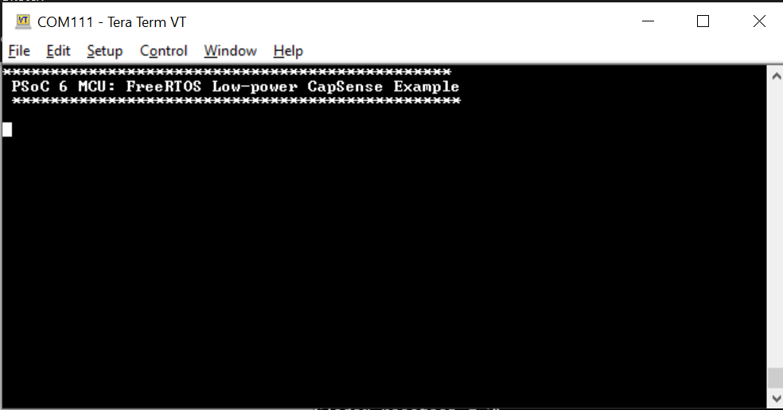

5. Slide your finger along the slider to view the touch position detected on the serial terminal as shown below:

    **Figure 2. Terminal output on touching the slider**

    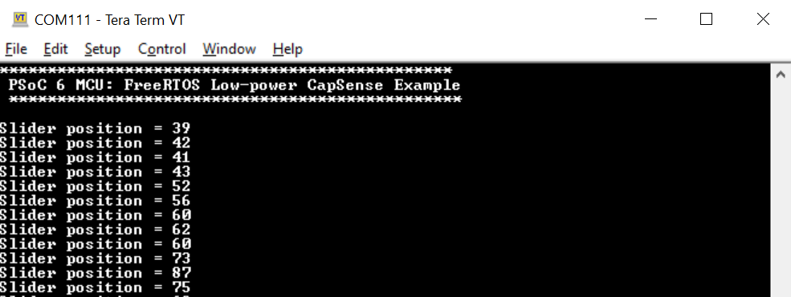

6. The example switches to slow scan if touch is not detected for `MAX_CAPSENSE_FAST_SCAN_COUNT` fast scans. The example indicates the transition to slow scan on the serial terminal as shown below:

    **Figure 3. Terminal output when shifting to slow scan**

    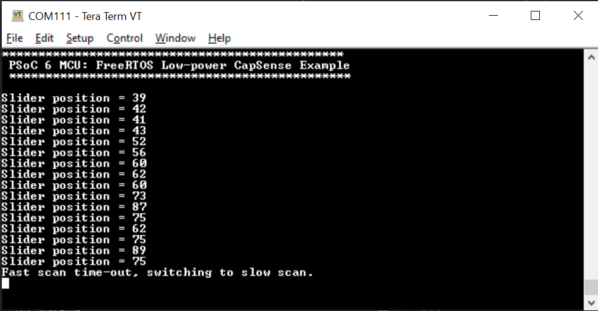

7. Touch the slider again to shift to fast scan. The example indicates the transition to fast scan on the serial terminal as shown below:

    **Figure 4. Terminal output when shifting to fast scan**

    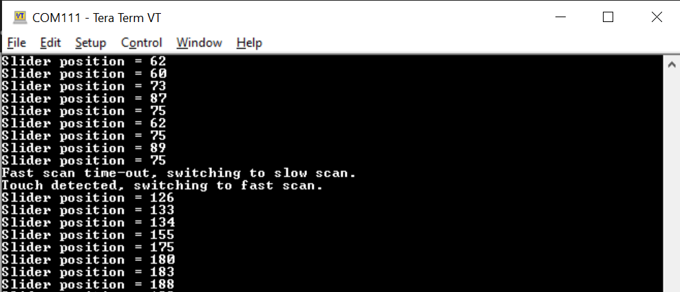

8. Measure the current as instructed in the [Making Current Measurements for PSoC 6 MCU Device](#making-current-measurements-for-psoc-6-mcu-device) section.

## Debugging

You can debug the example to step through the code. In the IDE, use the **\<Application Name> Debug (KitProg3_MiniProg4)** configuration in the **Quick Panel**. For more details, see the "Program and Debug" section in the [Eclipse IDE for ModusToolbox User Guide](https://www.cypress.com/MTBEclipseIDEUserGuide).

**Note:** **(Only while debugging)** On the CM4 CPU, some code in `main()` may execute before the debugger halts at the beginning of `main()`. This means that some code executes twice - once before the debugger stops execution, and again after the debugger resets the program counter to the beginning of `main()`. See [KBA231071](https://community.cypress.com/docs/DOC-21143) to learn about this and for the workaround.

## Design and Implementation

### Example overview

The example performs CapSense scans at two different rates. It scans at `CAPSENSE_FAST_SCAN_INTERVAL_MS` intervals (fast scan) when there is a touch detected on the slider, and at `CAPSENSE_SLOW_SCAN_INTERVAL_MS` interval (slow scan) when there is no touch detected for `MAX_CAPSENSE_FAST_SCAN_COUNT` fast scans. `CAPSENSE_FAST_SCAN_INTERVAL_MS`, `CAPSENSE_SLOW_SCAN_INTERVAL_MS`, and `MAX_CAPSENSE_FAST_SCAN_COUNT` can be configured in *source/capsense.c*.

The example uses two CapSense widgets; a Linear Slider which is set up and scanned during the fast scan, and a GangedSensor (button widget), which is set up and scanned during slow scan. The Linear Slider widget has 5 sensors, whereas the GangedSensor widget has only one sensor which corresponds to a ganged connection of the 5 sensors used in the Linear Slider widget.

The main function initializes the UART, and creates `capsense_task` before starting the FreeRTOS scheduler. The example disables support for CapSense Tuner by default. You can enable the tuner by defining the `CAPSENSE_TUNER_ENABLE` Makefile variable in the *Makefile*. 

The `capsense_task` is responsible for initializing the CapSense HW block, tuner communication if enabled, and scanning and processing the touch information. It also creates and starts a FreeRTOS timer instance which is used to signal the start of a new scan at the end of every timer period. The task implements an FSM to scan, process touch, and schedule sleep/ deep sleep. The state diagram for the FSM is shown below:

   **Figure 5. FSM State Diagram**

   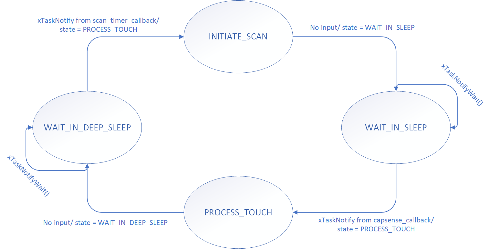

The FSM comprises the following states:

1. `INITIATE_SCAN`: In this state, the example checks if the CapSense HW block is busy. If not, the example initiates a CapSense scan and changes the state to `WAIT_IN_SLEEP`. If tuner is enabled, `Cy_CapSense_ScanAllWidgets` is called to scan the widgets. It is not called if tuner communication is disabled because it sets up and scans both the widgets used in this example which results in longer scan times. Instead, `Cy_CapSense_Scan` is called to scan the widget. The widget that is scanned is the one that was last set up using `Cy_CapSense_SetupWidget`.

2. `WAIT_IN_SLEEP`: In this state, the example locks deep sleep and waits for task notification from `capsense_callback` which signals that the CapSense scan has completed. The task notification updates the state variable to `POCESS_TOUCH`.

3. `PROCESS_TOUCH`: In this state, the device processes the scan data. The widget that is processed depends on the type of scan performed i.e., fast scan or slow scan.   

   In fast scan, if a new touch is detected, the value of `capsense_fast_scan_count` is reset to `RESET_CAPSENSE_FAST_SCAN_COUNT`, and the slider position is displayed on the serial terminal. If not, `capsense_fast_scan_count` is incremented until `MAX_CAPSENSE_FAST_SCAN_COUNT` after which the timer period is changed to `CAPSENSE_SLOW_SCAN_INTERVAL_MS` and the GangedSensor widget is set up for the next scan.  
   
   In slow scan, if a touch is detected for the GangedSensor widget, the example switches to fast scan mode by setting up the Linear Slider widget, resetting the value of `capsense_fast_scan_count` to `RESET_CAPSENSE_FAST_SCAN_COUNT`, and changing the timer period to `CAPSENSE_FAST_SCAN_INTERVAL_MS`.  
   
   After processing the touch data, the state variable is changed to `WAIT_IN_DEEP_SLEEP`.  

4. `WAIT_IN_DEEP_SLEEP`: In this state, the example unlocks deep sleep and waits for task notification from `scan_timer_callback` which signals that the timer period has elapsed and a new scan must be issued. The task notification updates the state variable to `INITIATE_SCAN`.

### Low-Power Design Considerations

The common techniques used for low-power operation of PSoC 6 MCU are:
1.	Reducing the operating frequency of the CPU
2.	Selecting System ULP mode over System LP
3.	Selecting a Buck regulator over LDO
4.	Retaining as less RAM as possible by disabling SRAM controllers

In addition to these, the following firmware changes are required to achieve a low-power CapSense design:

1.	Select Manual tuning against SmartSense auto-tuning - start from a lower resolution & higher mod clock for the fastest scan possible till you achieve desired performance. Please see the [AN85951 - PSoC 4 and PSoC 6 MCU CapSense Design Guide](https://www.cypress.com/documentation/application-notes/an85951-psoc-4-and-psoc-6-mcu-capsense-design-guide) for details on Manual tuning
2.	Reduce scan resolution to reduce scan time. 
3.	Perform scans at lower frequency when no touch has been detected. This enables the MCU to stay in deep sleep longer when no touch is detected. Increase the frequency when touch is detected to improve performance but at a cost of increase in current consumption.
4.	Use a widget in slow scan where the sensors of the widget used in fast scan are ganged together to constitute a single sensor for shorter scan times. Note that doing so increases the parasitic capacitance of the sensor.

Some of these configurations can be made using the Device Configurator and CapSense Configurator which are packaged with ModusToolbox. See the [Creating Custom device configuration for low-power](#creating-a-custom-device-configuration-for-low-power) section.

### Resources and Settings

**Table 1. Application Resources**

| Resource  |  Alias/Object     |    Purpose     |
| :------- | :------------    | :------------ |
| UART (HAL)|cy_retarget_io_uart_obj| UART HAL object used by Retarget-IO for Debug UART port  |
| I2C (HAL)|sEzI2C| Slave EZI2C used for CapSense Tuner communication. This object is not enabled by defult. |
| CapSense (Middleware)| CSD0 | CapSesnse HW used for scanning the position of touch on the linear slider.|


#### Creating a Custom Device Configuration for Low-power
The code example overrides the default device configuration provided in *<application_folder>/../mtb_shared/TARGET_\<kit>/latest_vX.Y/COMPONENT_BSP_DESIGN_MODUS* with the one provided in *<application_folder>/COMPONENT_CUSTOM_DESIGN_MODUS/TARGET_\<kit>* for the supported kits.  

The custom configuration disables the Phase-Locked Loop (PLL), selects system ULP power mode, selects Minimum Current Buck as the regulator, and provides a CapSense configuration with a Linear Slider and a GangedSensor widget.  

The Device Configurator is bundled with the ModusToolbox installation and can be found at *\<ModusToolbox_installed_location>/tools_\*.\*/device-configurator*.

The example ships with the device configuration in which the CM4 CPU is clocked by FLL at 48 MHz, CLK_PERI at 24 MHz, CapSense Mod clock at 24 MHz, and PSoC 6 MCU in ULP power mode.

Do the following to create a custom configuration for a new kit. The screenshots provided with the instructions use CY8CKIT-062-WIFI-BT as an example.

1. Create a new directory inside *COMPONENT_CUSTOM_DESIGN_MODUS* with the same name as the target you are building the example for, such as *<application_folder>/COMPONENT_CUSTOM_DESIGN_MODUS/TARGET_\<kit>*.

2. Copy the contents of the *COMPONENT_BSP_DESIGN_MODUS* folder at *<application_folder>/..//mtb_shared/TARGET_\<kit>/latest_vX.Y/COMPONENT_BSP_DESIGN_MODUS* into the folder created in the previous step except the *GeneratedSource* folder.  

**Note:** The files *design.cycapsense* and *design.qspi* are copied so that you don't have to configure these peripherals again. You only need to enable these peripherals in the *design.modus* file to use them.  

3. Open the copied *design.modus* file using Device Configurator. If prompted you need to provide a path to the device support library as shown below:

   **Figure 6. Prompt for Device Support Library Path**

   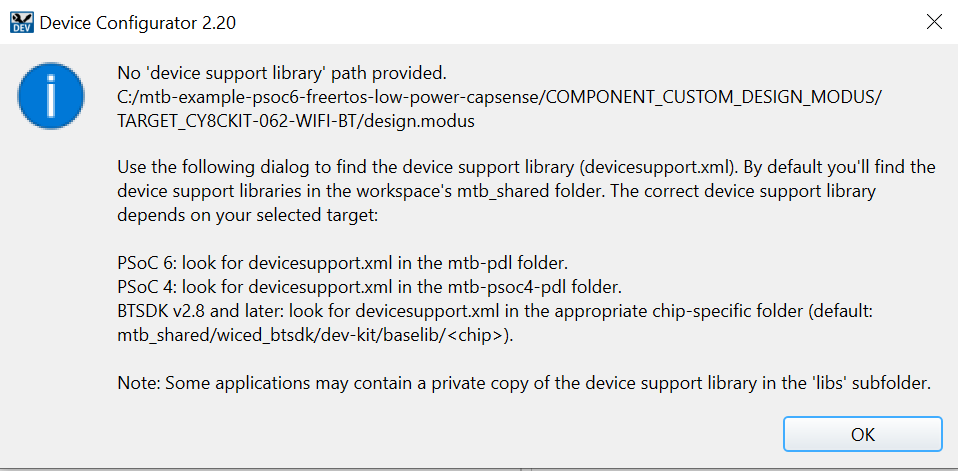

4.  Click **OK** and provide the path to the device support library in *<application_folder>/../mtb_shared/mtb-pdl-cat1/latest-vX.Y/devicesupport.xml* as shown below:

    **Figure 7. Select devicesupport.xml**

    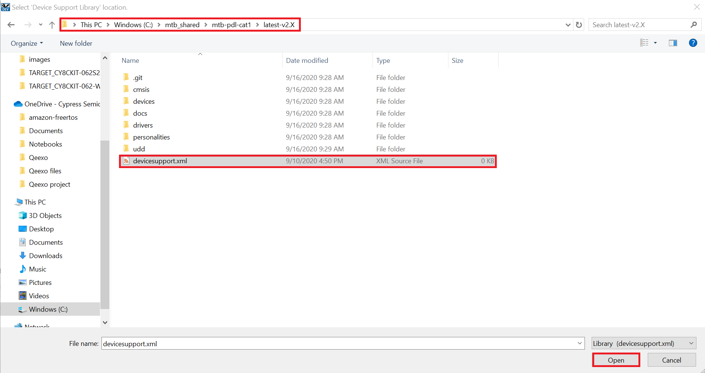

5. Under the **Power** resource, change the **Power mode** to **ULP**, and change the **Core Regulator** under **General** to **Minimum Current Buck** as shown below:

    **Figure 8. Change Power mode settings**

    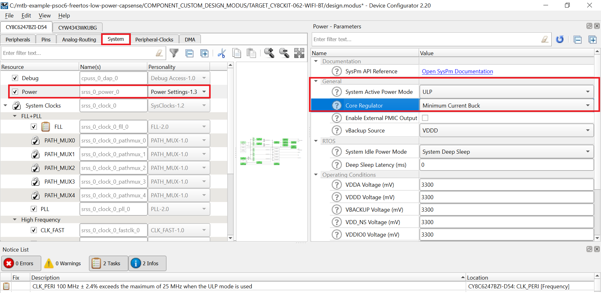

6. Switch to the **System** tab and expand the **System Clocks** resource. Disable all instances of the PLL by un-checking the box in the **FLL+PLL** section as shown below:

    **Figure 9. Disable PLL**

    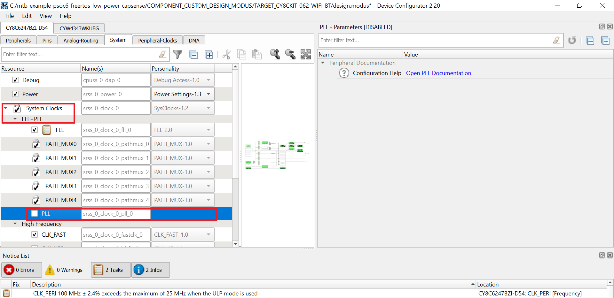

   PLL is disabled because they consume higher current even though the noise performance is better than FLL.

   **If you are using the FLL to source the clock to CPU:**

   1. Enable the FLL in the **FLL+PLL** section if disabled by checking the box. The  maximum operating frequency is 50 MHz in ULP mode; the FLL supports a range of 24-100 MHz. So, provide the value of frequency within 24-50 MHz. This example uses a frequency of 48 MHz as shown below:

       **Figure 10. Enable FLL**

       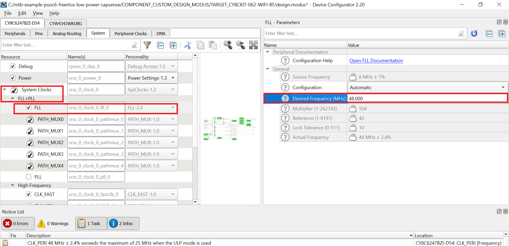
   
   2. The CM4 CPU is clocked by **CLK_FAST** which is derived from **CLK_HF0**. Ensure that **CLK_HF0** is allotted **CLK_PATH0** to connect **CLK_HF0** to FLL as shown below:

       **Figure 11. Change clock path**

       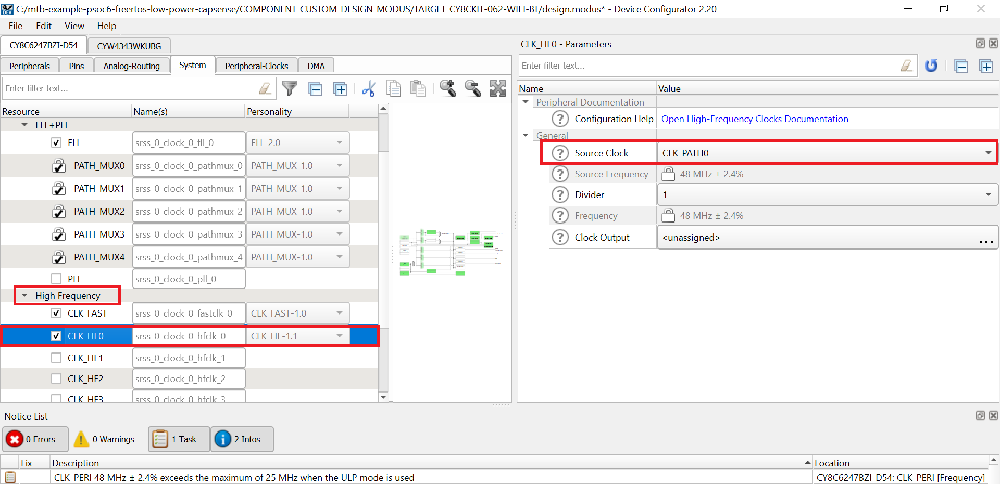

   3. **CLK_PERI** in ULP mode cannot exceed 25 MHz, so ensure that **CLK_PERI** is not greater than 25 MHz by changing the divider appropriately as shown below. Optionally, if the FLL frequency is 24 MHz, you can change the divider for **CLK_PERI** to 1.

       **Figure 12. Change divider for CLK_PERI**

       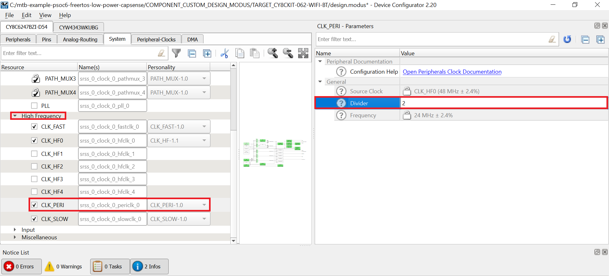

   **If you are using the IMO to source the clock to CPU:**

   1. You can also use the IMO to clock the CPU. Disable the FLL in the **FLL+PLL** section if enabled as shown below:

       **Figure 13. Disable FLL**

       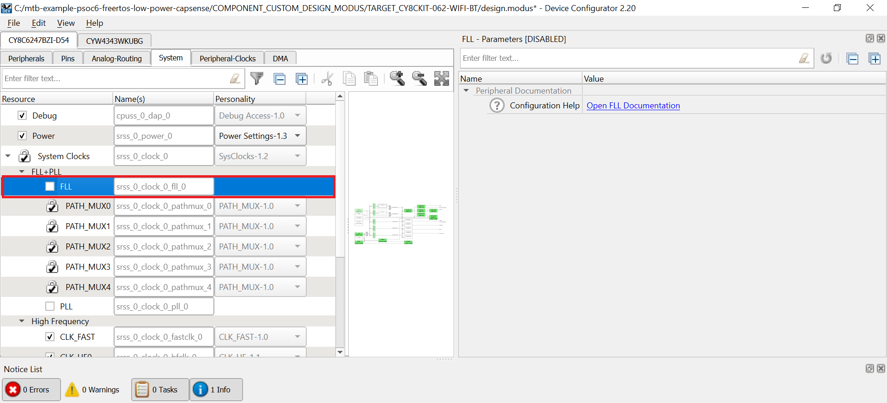

   2. In the **High Frequency** section under **System Clocks**, select **CLK_PERI** and decrease the divider to 1 as shown below: 
   
       **Figure 14. Change divider for CLK_PERI**
       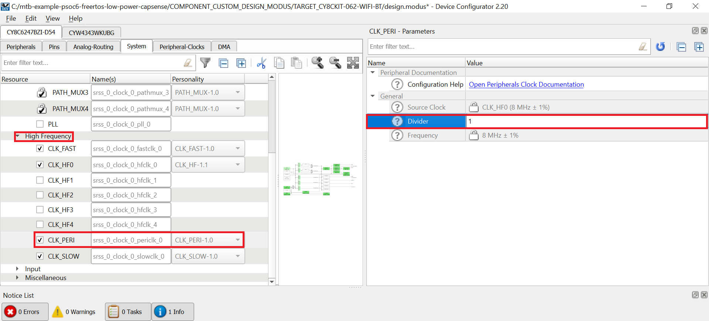

      Because the source clock is IMO, which is at 8 MHZ, CLK_PERI can also be configured to run at 8 MHZ. This helps in a better performance of the peripherals than when the divider is set as 2.

7. Save the file, switch to the **Peripherals** tab, and select **CSD(CapSense, etc.)** under **System**. Select **Launch CapSense Configurator** in the panel on the right as shown below: 

    **Figure 15. Launch CapSense Configurator**

    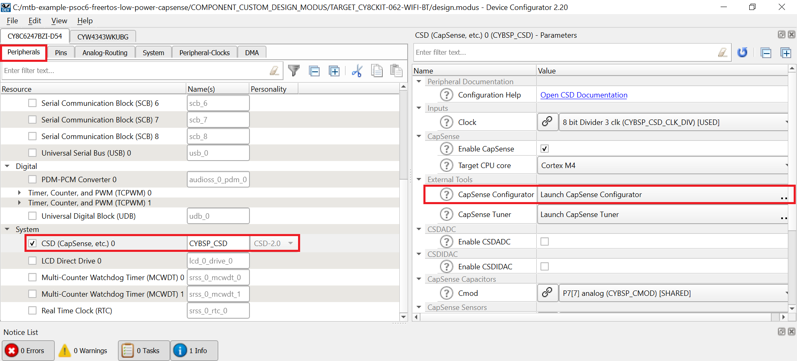

8. In the **Basic** tab of CapSense Configurator, create a new self-capacitance button widget called "GangedSensor", delete the Button0 and Button1 widgets, and select **Manual Tuning** as shown below:

    **Figure 16. Configure Widgets**

    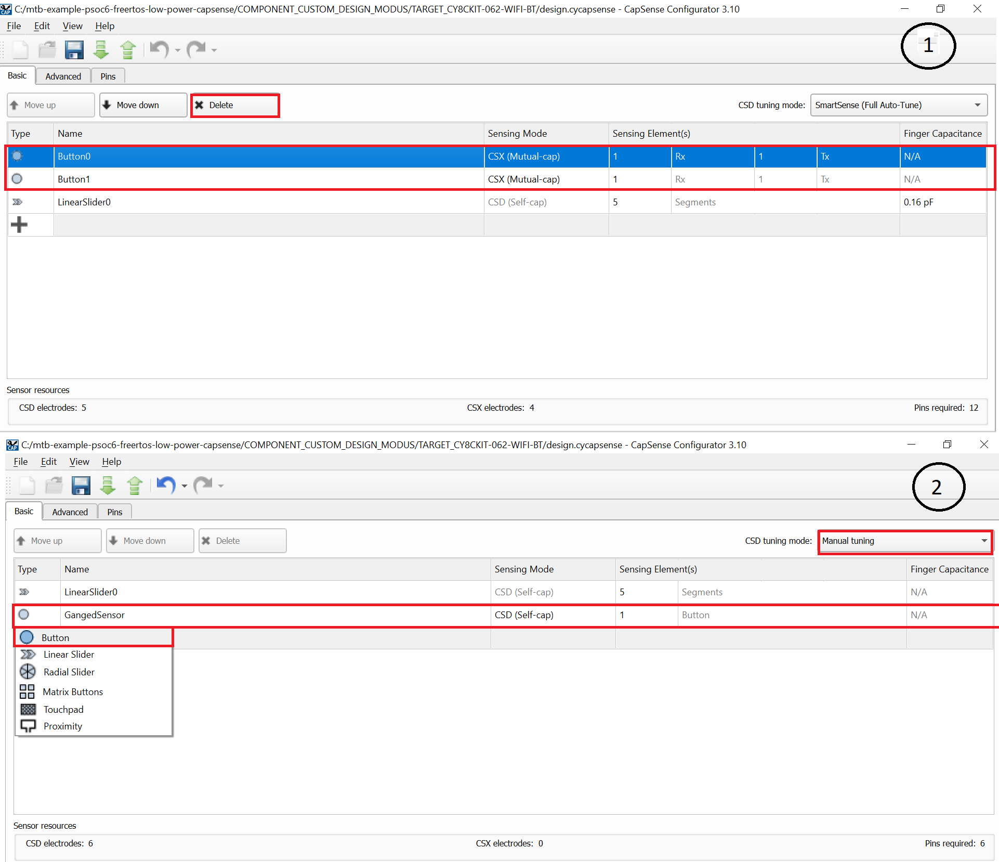

9. Open the **Advanced** tab.

   **If you are using FLL to source the clock to CPU:**
   
   1.  Open the **CSD settings** tab and set the modulator clock divider such that the modulator clock frequency is below 50 MHz. This example uses the modulator clock of 24 MHz for a FLL frequency of 48 MHz as shown below:

    **Figure 17. Configure Modulator clock**

    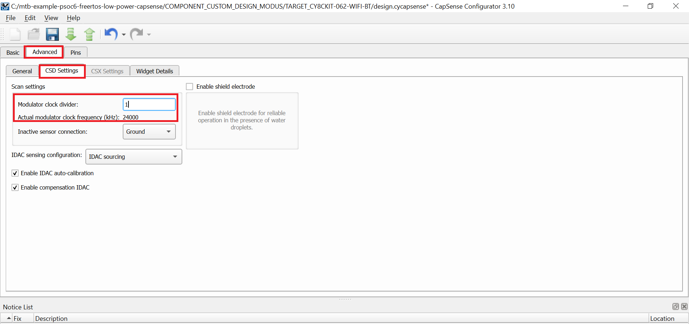
   
   2. Open the **Widget Details** tab, select **LinearSlider0**, and change the **Widget hardware parameters** and **Widget threshold parameters** as shown below:

    **Figure 18. Configure Linear Slider Widget Parameters**

    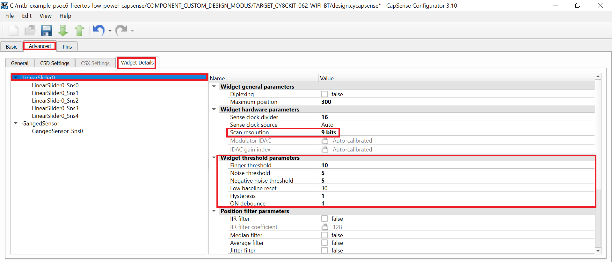

   3. Select **GangedSensor** and change the **Widget hardware parameters** and **Widget threshold parameters** as shown below:

    **Figure 19. Configure GangedSensor Widget Parameters**

    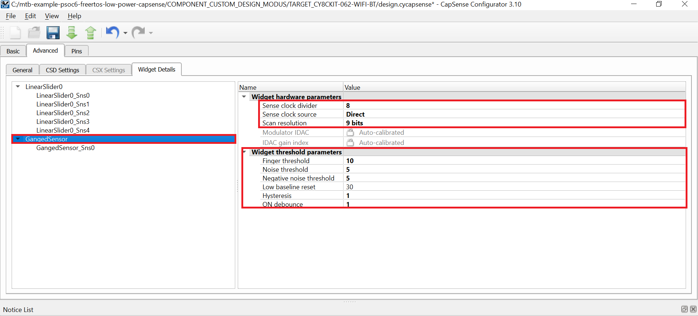

    **If you are using IMO to source the clock to CPU:**
    
    1.  Open the **CSD settings** tab and set the modulator clock divider to 1 as shown below. Increasing the modulator clock divider will result in reduction in performance.

    **Figure 20. Configure Modulator clock**

    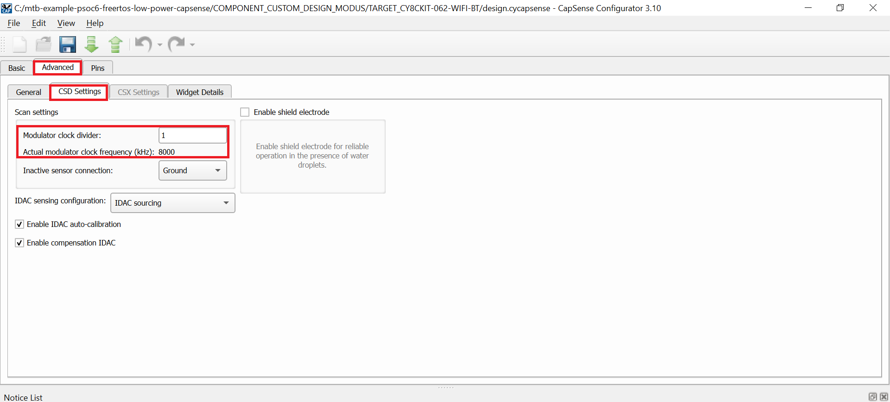
   
    2. Open the **Widget Details** tab, select **LinearSlider0**, and change the **Widget hardware parameters** and **Widget threshold parameters** as shown below:

    **Figure 21. Configure Linear Slider Widget Parameters**

    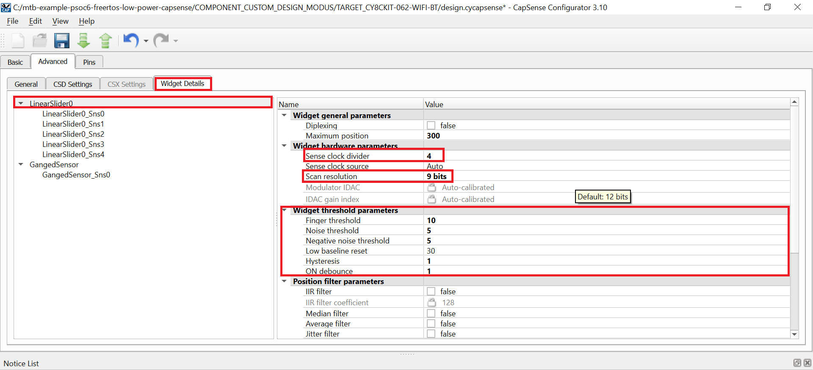

    3. Select **GangedSensor** and change the **Widget hardware parameters** and **Widget threshold parameters** as shown below:

    **Figure 22. Configure GangedSensor Widget Parameters**

    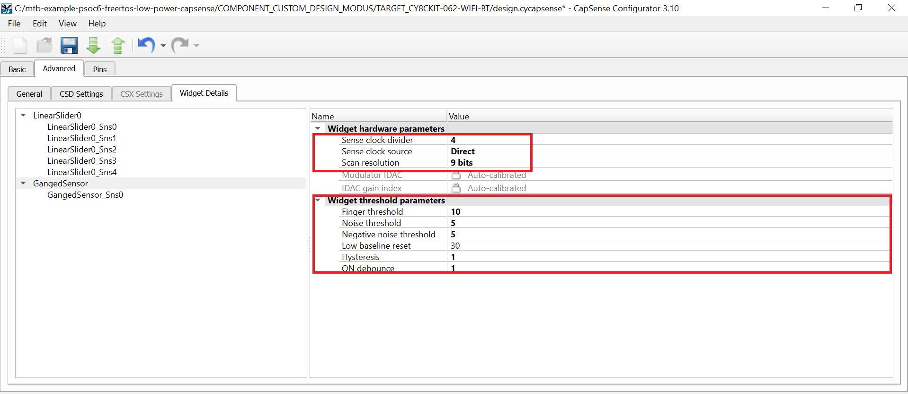

10. Select **GangedSensor_Sns0** under **Widget Details** of the **Advanced** tab. In the **Sensor connections** option on the right panel, unselect **dedicated pin** and select the rest as shown below to create a ganged connection of the sensors of the Linear Slider:

    **Figure 23. Configure GangedSensor Widget Parameters**

    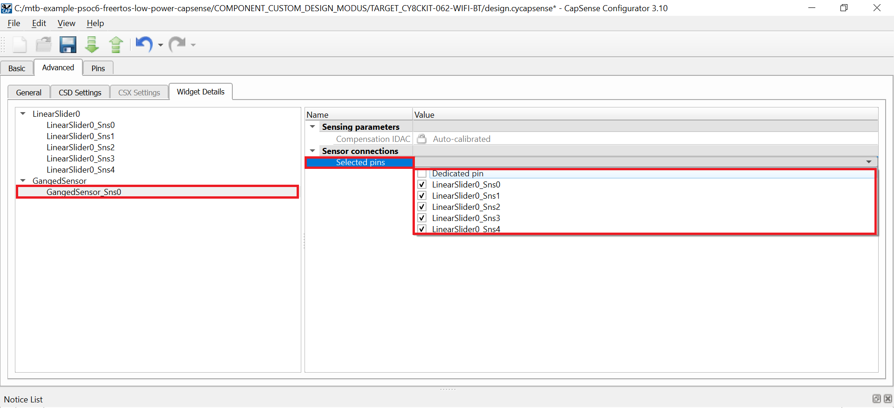

11. Save and close CapSense Configurator. Return to Device Configurator and save the file to generate the source files.

12. Disable the default configuration and enable the custom configuration by making the following changes in *Makefile*:

   ```
   DISABLE_COMPONENTS += BSP_DESIGN_MODUS
   COMPONENTS += CUSTOM_DESIGN_MODUS
   ```

#### Considerations for Widget Parameters in CapSense Configurator

1. The example reduces the scan resolution to 9 bits as shown in Figure 18-19 and Figure 21-22. Reducing the scan resolution reduces the scan time at the cost of accuracy.

2. Because the accuracy of capacitance measurements at the sensors is reduced, the Widget threshold parameters, i.e., Finger Threshold, Noise threshold etc., need to updated according to the observed values of raw counts. 

   Enable tuner communication by defining the `CAPSENSE_TUNER_ENABLE` variable in the *Makefile* and program the example.

   **Using CapSense Tuner to monitor data:**

   1. Open CapSense Tuner from the IDE Quick Panel. 
    
       You can also run the CapSense Tuner application standalone from *{ModusToolbox install directory}/ModusToolbox/tools_{version}/capsense-configurator/capsense-tuner*. In this case, after opening the application, select **File** > **Open** and open the *design.cycapsense* file for the respective kit, which is present in the *TARGET_\<BSP-NAME>/{version}/COMPONENT_BSP_DESIGN_MODUS* or *COMPONENT_CUSTOM_DESIGN_MODUS* folder. 

    2. Ensure that the kit is in KitProg3 mode. See [Firmware-loader](https://github.com/cypresssemiconductorco/Firmware-loader) to learn on how to update the firmware and switch to KitProg3 mode.

    3. In the Tuner application, click **Tuner Communication Setup** or select **Tools** > **Tuner Communication Setup**. In the window that appears, select the I2C checkbox under KitProg3 and configure as follows: 

       - I2C Address: 8
       - Sub-address: 2-Bytes
       - Speed (kHz): 400

    5. Click **Connect** or select **Communication** > **Connect**.

    6. Click **Start** or select **Communication** > **Start**.

    Under the **Widget View** tab, you can see the corresponding widgets highlighted in blue color when you touch the button or slider. You can also view the sensor data in the **Graph View** tab. For example, to view the sensor data for Button 0, select **Button0_Rx0** under **Button0**. 

    Figure 24 shows the CapSense Tuner displaying the status of CapSense touch on LinearSlider 0 and GangedSensor:

    **Figure 24. CapSense Tuner Showing Touch Data**

    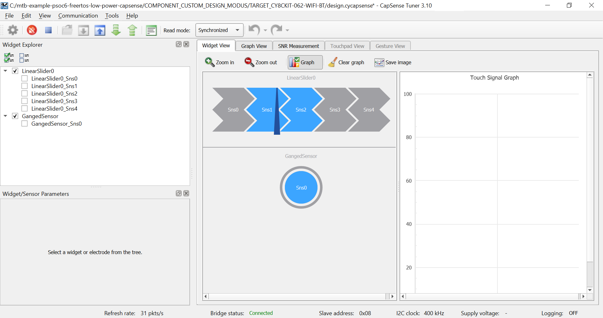

    The CapSense Tuner can also be used for CapSense parameter tuning, and measuring signal-to-noise ratio (SNR). See the [ModusToolbox CapSense Tuner Guide](https://www.cypress.com/ModusToolboxCapSenseTuner) (**Help** > **View Help**) and [AN85951 – PSoC 4 and PSoC 6 MCU CapSense Design Guide](https://www.cypress.com/an85951) for more details on selecting the tuning parameters.

3. In the Widget Threshold Parameters, the ON debounce is set as 1, which can result in false positives for touch detection. Increase the value to 3 to reduce false positives; however, this will mean a poor reaction time in slow scan mode.

4. The sensor clock divider for GangedSensor is increased to 8 when CapSense modulator clock frequency of 24 MHz. This is because its sensor, which comprises a ganged connection of 5 sensors, has a high parasitic capacitance that requires more time for making measurements. Reducing the sensor clock divider can result in failure to initialize CapSense due to a calibration error for the sensor. 

5. The sensor clock source for the GangedSensor is chosen as Direct instead PRS* or SS* clock. This is because SS* and PRS* modulate the clock, which results in varying pulse widths. This can cause errors when making measurements of the GangedSensor sensor due to its high parasitic capacitance.

## Operation at Custom Power Supply Voltage

The application is configured to work with the default operating voltage of the kit.

**Table 1. Operating Voltages Supported by the Kits**

| Kit                   | Supported Operating Voltages | Default Operating Voltage |
| :-------------------- | ---------------------------- | ------------------------- |
| CY8CPROTO-062-4343W   | 3.3 V / 1.8 V                | 3.3 V                     |
| CY8CKIT-062-BLE       | 3.3 V / 1.8 V                | 3.3 V                     |
| CY8CKIT-062-WIFI-BT   | 3.3 V / 1.8 V                | 3.3 V                     |
| CY8CKIT-062S2-43012   | 3.3 V / 1.8 V                | 3.3 V                     |
| CYW9P62S1-43438EVB-01 | 3.3 V Only                   | 3.3 V                     |
| CYW9P62S1-43012EVB-01 | 1.8 V Only                   | 1.8 V                     |
| CY8CPROTO-062S3-4343W | 3.3 V / 1.8 V                | 3.3 V                     |

For kits that support multiple operating voltages, follow the instructions to use the example at a custom power supply, such as 1.8 V:

1. Launch the [Device Configurator](https://www.cypress.com/ModusToolboxDeviceConfig) tool using the Quick panel link in the IDE. This opens the *design.modus* file from the *COMPONENT_CUSTOM_DESIGN_MODUS/TARGET_\<kit>* folder. 

2. Update the **Operating Conditions** parameters in Power settings with the desired voltage and select **File** > **Save**.

   **Figure 25. Power Settings to Work with 1.8 V**

   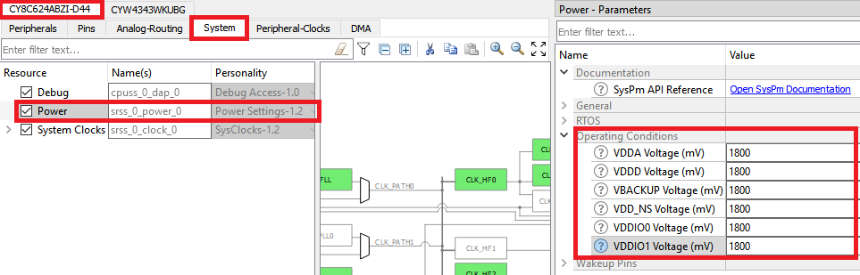

3. Change the jumper/switch setting as follows: 

   **Table 2. Jumper/Switch Position for 1.8 V Operation**

   | Kit                   | Jumper/Switch Position |
   | :-------------------- | ---------------------- |
   | CY8CPROTO-062-4343W   | J3 (1-2)               |
   | CY8CKIT-062-BLE       | SW5 (1-2)              |
   | CY8CKIT-062-WIFI-BT   | SW5 (1-2)              |
   | CY8CKIT-062S2-43012   | J14 (1-2)              |
   | CY8CPROTO-062S3-4343W | J3 (1-2)               |
   | CY8CKIT-064B0S2-4343W | J14 (1-2)              |

4. Re-build and program the application to evaluate the application at the new power setting.

### Making Current Measurements for PSoC 6 MCU Device

- **CY8CKIT_062S2_43012, CYW9P62S1_43438EVB_01, and CYW9P62S1_43012EVB_01** 

   Measure the current at J15 across VTARG and P6_VDD. Ensure that J25 is removed to eliminate leakage currents across potentiometer R1.


- **CY8CPROTO_062_4343W**

   Measure the current by removing R65 on the right of the board close to the USB connector of PSoC 6 MCU USB (device), and connecting an ammeter between VTARG (J2.32) and P6_VDD (J2.24).

   The PSoC 6 MCU deep sleep current is approximately 350 uA because of the pull-up resistor, R24, attached to the WL_HOST_WAKE pin P0_4, which leaks around 330 uA. This is because P0_4 is driven LOW when there is no network activity. Therefore, remove R24 (at the back of the board, below J1.9).

- **CY8CPROTO_062S3_4343W**

   Measure the current by removing R59 on the back of the board, towards the right and above J2.31, and connecting an ammeter between VTARG (J2.32) and P6_VDD (J2.31).

- **CY8CKIT_062_WIFI_BT**

   Measure the current by connecting an ammeter to the PWR MON jumper J8.

- **CY8CKIT_062_BLE**

   Measure the current by connecting an ammeter to the PWR MON jumper J8.

### Current Measurements

Table 3 provides the typical current measurement values where PSoC 6 MCU is operated with the Arm® Cortex®-M4 CPU (CM4) running at 48 MHz in Ultra Low Power (ULP) mode with **Minimum Current Buck** selected as the regulator. The amount of SRAM retained is provided in the table below. **CLK_PERI** and CapSense Modulator clock run at 48 MHz.

**Table 3. Typical Current Values when CPU Clock Is Sourced by FLL**

<table> 
<tr><th>Target</th><th>Amount of SRAM retained</th><th>Slow scan ( Scan GangedSensor at 5 Hz. The widget has only 1 sensor which is a ganged connection of 5 sensors fom the Linear Slider widget.)</th><th>Fast scan (Scan LinearSlider widget at 50 Hz. The widget has 5 sensors.)</th></tr>
        <tr>
            <td>CY8CKIT-062-BLE</td>
            <td>64 KB(Block 0 and Block 9 of SRAM0 are retained</td>
            <td>26 uA</td>
            <td>255 uA</td>
        </tr>
        <tr>
            <td>CY8CKIT-062-WIFI-BT</td>
            <td>64 KB(Block 0 and Block 9 of SRAM0 are retained</td>
            <td>26 uA</td>
            <td>300 uA</td>
        </tr>
        <tr>
            <td>CY8CKIT-062S2-43012</td>
            <td>288 KB(Block 0 of SRAM0 and 256 KB of SRAM2 are retained)</td>
            <td>26 uA</td>
            <td>315 uA</td>
        </tr>
        <tr>
            <td>CY8CPROTO-062-4343W</td>
            <td>288 KB(Block 0 of SRAM0 and 256 KB of SRAM2 are retained)</td>
            <td>26.6 uA</td>
            <td>350 uA</td>
        </tr>
        <tr>
            <td>CY8CPROTO-062S3-4343W</td>
            <td>64 KB(Block 0 and Block 8 of SRAM0 are retained</td>
            <td>20.7 uA</td>
            <td>230 uA</td>
        </tr>
        <tr>
            <td>CYW9P62S1-43012EVB-01</td>
            <td>64 KB(Block 0 and Block 9 of SRAM0 are retained</td>
            <td>25.2 uA</td>
            <td>360 uA</td>
        </tr>
        <tr>
            <td>CYW9P62S1-43438EVB-01</td>
            <td>64 KB(Block 0 and Block 9 of SRAM0 are retained</td>
            <td>23 uA</td>
            <td>260 uA</td>
        </tr>
        <tr>
            <td>CY8CKIT-064B0S2-4343W</td>
            <td>288 KB(Block 0 of SRAM0 and 256 KB of SRAM2 are retained)</td>
            <td>30.6 uA</td>
            <td>365 uA</td>
        </tr>
 </table>

 Table 4 provides the typical current measurement values where PSoC 6 MCU is operated with CM4 running at 8 MHz in Ultra Low Power (ULP) mode with **Minimum Current Buck** selected as the regulator. The amount of SRAM retained is provided in the table below. **CLK_PERI** and CapSense Modulator clock run at 8 MHz.

**Table 4. Typical Current Values when CPU clocked is sourced by IMO**

<table> 
<tr><th>Target</th><th>Amount of SRAM retained</th><th>Slow scan ( Scan GangedSensor at 5 Hz. The widget has only 1 sensor which is a ganged connection of 5 sensors fom the Linear Slider widget.)</th><th>Fast scan (Scan LinearSlider widget at 50 Hz. The widget has 5 sensors.)</th></tr>
        <tr>
            <td>CY8CKIT-062-BLE</td>
            <td>64 KB(Block 0 and Block 9 of SRAM0 are retained</td>
            <td>23 uA</td>
            <td>165 uA</td>
        </tr>
        <tr>
            <td>CY8CKIT-062-WIFI-BT</td>
            <td>64 KB(Block 0 and Block 9 of SRAM0 are retained</td>
            <td>23 uA</td>
            <td>170 uA</td>
        </tr>
        <tr>
            <td>CY8CKIT-062S2-43012</td>
            <td>288 KB(Block 0 of SRAM0 and 256 KB of SRAM2 are retained)</td>
            <td>23 uA</td>
            <td>165 uA</td>
        </tr>
        <tr>
            <td>CY8CPROTO-062-4343W</td>
            <td>288 KB(Block 0 of SRAM0 and 256 KB of SRAM2 are retained)</td>
            <td>22.3 uA</td>
            <td>190 uA</td>
        </tr>
        <tr>
            <td>CY8CPROTO-062S3-4343W</td>
            <td>64 KB(Block 0 and Block 8 of SRAM0 are retained</td>
            <td>18.6 uA</td>
            <td>146.6 uA</td>
        </tr>
        <tr>
            <td>CYW9P62S1-43012EVB-01</td>
            <td>64 KB(Block 0 and Block 9 of SRAM0 are retained</td>
            <td>19.0 uA</td>
            <td>185 uA</td>
        </tr>
        <tr>
            <td>CYW9P62S1-43438EVB-01</td>
            <td>64 KB(Block 0 and Block 9 of SRAM0 are retained</td>
            <td>20 uA</td>
            <td>170 uA</td>
        </tr>
        <tr>
            <td>CY8CKIT-064B0S2-4343W</td>
            <td>288 KB(Block 0 of SRAM0 and 256 KB of SRAM2 are retained)</td>
            <td>27.6 uA</td>
            <td>210.5 uA</td>
        </tr>
 </table>

## Related Resources

| Application Notes                                            |                                                              |
| :----------------------------------------------------------- | :----------------------------------------------------------- |
| [AN228571](https://www.cypress.com/AN228571) – Getting Started with PSoC 6 MCU on ModusToolbox | Describes PSoC 6 MCU devices and how to build your first application with ModusToolbox |
| [AN221774](https://www.cypress.com/AN221774) – Getting Started with PSoC 6 MCU on PSoC Creator | Describes PSoC 6 MCU devices and how to build your first application with PSoC Creator |
| [AN210781](https://www.cypress.com/AN210781) – Getting Started with PSoC 6 MCU with Bluetooth Low Energy (BLE) Connectivity on PSoC Creator | Describes PSoC 6 MCU with BLE Connectivity devices and how to build your first application with PSoC Creator |
| [AN215656](https://www.cypress.com/AN215656) – PSoC 6 MCU: Dual-CPU System Design | Describes the dual-CPU architecture in PSoC 6 MCU, and shows how to build a simple dual-CPU design |
| **Code Examples**                                            |                                                              |
| [Using ModusToolbox](https://github.com/cypresssemiconductorco/Code-Examples-for-ModusToolbox-Software) | [Using PSoC Creator](https://www.cypress.com/documentation/code-examples/psoc-6-mcu-code-examples) |
| **Device Documentation**                                     |                                                              |
| [PSoC 6 MCU Datasheets](https://www.cypress.com/search/all?f[0]=meta_type%3Atechnical_documents&f[1]=resource_meta_type%3A575&f[2]=field_related_products%3A114026) | [PSoC 6 Technical Reference Manuals](https://www.cypress.com/search/all/PSoC%206%20Technical%20Reference%20Manual?f[0]=meta_type%3Atechnical_documents&f[1]=resource_meta_type%3A583) |
| **Development Kits**                                         | Buy at www.cypress.com                                       |
| [CY8CKIT-062-BLE](https://www.cypress.com/CY8CKIT-062-BLE) PSoC 6 BLE Pioneer Kit | [CY8CKIT-062-WiFi-BT](https://www.cypress.com/CY8CKIT-062-WiFi-BT) PSoC 6 WiFi-BT Pioneer Kit |
| [CY8CPROTO-063-BLE](https://www.cypress.com/CY8CPROTO-063-BLE) PSoC 6 BLE Prototyping Kit | [CY8CPROTO-062-4343W](https://www.cypress.com/CY8CPROTO-062-4343W) PSoC 6 Wi-Fi BT Prototyping Kit |
| [CY8CKIT-062S2-43012](https://www.cypress.com/CY8CKIT-062S2-43012) PSoC 62S2 Wi-Fi BT Pioneer Kit | [CY8CPROTO-062S3-4343W](https://www.cypress.com/CY8CPROTO-062S3-4343W) PSoC 62S3 Wi-Fi BT Prototyping Kit |
| [CYW9P62S1-43438EVB-01](https://www.cypress.com/CYW9P62S1-43438EVB-01) PSoC 62S1 Wi-Fi BT Pioneer Kit | [CYW9P62S1-43012EVB-01](https://www.cypress.com/CYW9P62S1-43012EVB-01) PSoC 62S1 Wi-Fi BT Pioneer Kit | 
|[CY8CKIT-064B0S2-4343W](http://www.cypress.com/CY8CKIT-064B0S2-4343W) PSoC 64 Secure Boot Wi-Fi BT Pioneer Kit |                                     |
| **Libraries**                                                 |                                                              |
| PSoC 6 Peripheral Driver Library (PDL) and docs  | [mtb-pdl-cat1](https://github.com/cypresssemiconductorco/mtb-pdl-cat1) on GitHub |
| Cypress Hardware Abstraction Layer (HAL) Library and docs     | [mtb-hal-cat1](https://github.com/cypresssemiconductorco/mtb-hal-cat1) on GitHub |
| Retarget IO - A utility library to retarget the standard input/output (STDIO) messages to a UART port | [retarget-io](https://github.com/cypresssemiconductorco/retarget-io) on GitHub |
| **Middleware**                                               |                                                              |
| CapSense® library and docs                                    | [capsense](https://github.com/cypresssemiconductorco/capsense) on GitHub |
| Links to all PSoC 6 MCU Middleware                           | [psoc6-middleware](https://github.com/cypresssemiconductorco/psoc6-middleware) on GitHub |
| **Tools**                                                    |                                                              |
| [Eclipse IDE for ModusToolbox](https://www.cypress.com/modustoolbox)     | The cross-platform, Eclipse-based IDE for IoT designers that supports application configuration and development targeting converged MCU and wireless systems.             |
| [PSoC Creator™](https://www.cypress.com/products/psoc-creator-integrated-design-environment-ide) | The Cypress IDE for PSoC and FM0+ MCU development.            |

## Other Resources

Cypress provides a wealth of data at www.cypress.com to help you select the right device, and quickly and effectively integrate it into your design.

For PSoC 6 MCU devices, see [How to Design with PSoC 6 MCU - KBA223067](https://community.cypress.com/docs/DOC-14644) in the Cypress community.

## Document History

Document Title: *CE230968* - *PSoC 6 MCU: Low-Power CapSense (FreeRTOS)*

| Version | Description of Change |
| ------- | --------------------- |
| 1.0.0   | New code example      |
------

All other trademarks or registered trademarks referenced herein are the property of their respective owners.


-------------------------------------------------------------------------------

© Cypress Semiconductor Corporation, 2020. This document is the property of Cypress Semiconductor Corporation and its subsidiaries ("Cypress"). This document, including any software or firmware included or referenced in this document ("Software"), is owned by Cypress under the intellectual property laws and treaties of the United States and other countries worldwide. Cypress reserves all rights under such laws and treaties and does not, except as specifically stated in this paragraph, grant any license under its patents, copyrights, trademarks, or other intellectual property rights. If the Software is not accompanied by a license agreement and you do not otherwise have a written agreement with Cypress governing the use of the Software, then Cypress hereby grants you a personal, non-exclusive, nontransferable license (without the right to sublicense) (1) under its copyright rights in the Software (a) for Software provided in source code form, to modify and reproduce the Software solely for use with Cypress hardware products, only internally within your organization, and (b) to distribute the Software in binary code form externally to end users (either directly or indirectly through resellers and distributors), solely for use on Cypress hardware product units, and (2) under those claims of Cypress's patents that are infringed by the Software (as provided by Cypress, unmodified) to make, use, distribute, and import the Software solely for use with Cypress hardware products. Any other use, reproduction, modification, translation, or compilation of the Software is prohibited.  
TO THE EXTENT PERMITTED BY APPLICABLE LAW, CYPRESS MAKES NO WARRANTY OF ANY KIND, EXPRESS OR IMPLIED, WITH REGARD TO THIS DOCUMENT OR ANY SOFTWARE OR ACCOMPANYING HARDWARE, INCLUDING, BUT NOT LIMITED TO, THE IMPLIED WARRANTIES OF MERCHANTABILITY AND FITNESS FOR A PARTICULAR PURPOSE. No computing device can be absolutely secure. Therefore, despite security measures implemented in Cypress hardware or software products, Cypress shall have no liability arising out of any security breach, such as unauthorized access to or use of a Cypress product. CYPRESS DOES NOT REPRESENT, WARRANT, OR GUARANTEE THAT CYPRESS PRODUCTS, OR SYSTEMS CREATED USING CYPRESS PRODUCTS, WILL BE FREE FROM CORRUPTION, ATTACK, VIRUSES, INTERFERENCE, HACKING, DATA LOSS OR THEFT, OR OTHER SECURITY INTRUSION (collectively, "Security Breach"). Cypress disclaims any liability relating to any Security Breach, and you shall and hereby do release Cypress from any claim, damage, or other liability arising from any Security Breach. In addition, the products described in these materials may contain design defects or errors known as errata which may cause the product to deviate from published specifications. To the extent permitted by applicable law, Cypress reserves the right to make changes to this document without further notice. Cypress does not assume any liability arising out of the application or use of any product or circuit described in this document. Any information provided in this document, including any sample design information or programming code, is provided only for reference purposes. It is the responsibility of the user of this document to properly design, program, and test the functionality and safety of any application made of this information and any resulting product. "High-Risk Device" means any device or system whose failure could cause personal injury, death, or property damage. Examples of High-Risk Devices are weapons, nuclear installations, surgical implants, and other medical devices. "Critical Component" means any component of a High-Risk Device whose failure to perform can be reasonably expected to cause, directly or indirectly, the failure of the High-Risk Device, or to affect its safety or effectiveness. Cypress is not liable, in whole or in part, and you shall and hereby do release Cypress from any claim, damage, or other liability arising from any use of a Cypress product as a Critical Component in a High-Risk Device. You shall indemnify and hold Cypress, its directors, officers, employees, agents, affiliates, distributors, and assigns harmless from and against all claims, costs, damages, and expenses, arising out of any claim, including claims for product liability, personal injury or death, or property damage arising from any use of a Cypress product as a Critical Component in a High-Risk Device. Cypress products are not intended or authorized for use as a Critical Component in any High-Risk Device except to the limited extent that (i) Cypress's published data sheet for the product explicitly states Cypress has qualified the product for use in a specific High-Risk Device, or (ii) Cypress has given you advance written authorization to use the product as a Critical Component in the specific High-Risk Device and you have signed a separate indemnification agreement.  
Cypress, the Cypress logo, Spansion, the Spansion logo, and combinations thereof, WICED, PSoC, CapSense, EZ-USB, F-RAM, and Traveo are trademarks or registered trademarks of Cypress in the United States and other countries. For a more complete list of Cypress trademarks, visit cypress.com. Other names and brands may be claimed as property of their respective owners.
